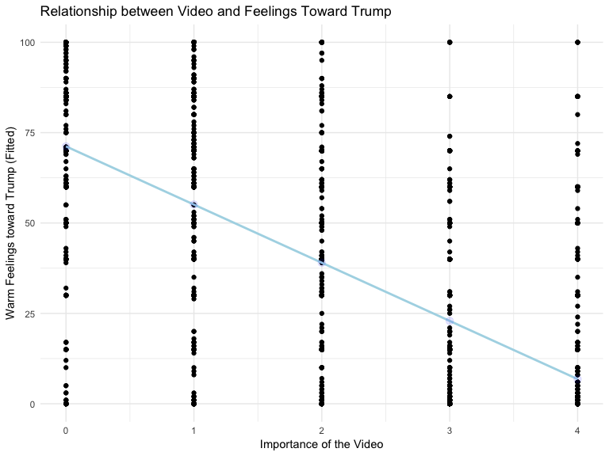

Part 1: Trump
================
Jess Robinson
May 13, 2019

Import Data
-----------

Data comes from [the 2012 American National Election Studies survey](http://www.electionstudies.org/).

1. Basic Linear Regression
--------------------------

Fitted Values
-------------

|  video|    .fitted|    .se.fit|
|------:|----------:|----------:|
|      0|  71.200838|  0.7792244|
|      1|  55.105464|  0.5620744|
|      2|  39.010090|  0.4457164|
|      3|  22.914716|  0.5053682|
|      4|   6.819342|  0.6972299|

Graph of Fitted Values
----------------------

Statistical Signficance
-----------------------

| term        |   estimate|  std.error|  statistic|  p.value|
|:------------|----------:|----------:|----------:|--------:|
| (Intercept) |   71.20084|  0.7792244|   91.37399|        0|
| video       |  -16.09537|  0.2949563|  -54.56867|        0|

|  r.squared|  adj.r.squared|     sigma|  statistic|  p.value|   df|     logLik|       AIC|       BIC|  deviance|  df.residual|
|----------:|--------------:|---------:|----------:|--------:|----:|----------:|---------:|---------:|---------:|------------:|
|  0.4797591|      0.4795979|  25.16696|   2977.739|        0|    2|  -15005.28|  30016.57|  30034.81|   2045171|         3229|

There appears to be a strongly significant relationship between response to the video and attitudes towards Trump. This model has a p-value of 0. Importance of to the video explains approximately 48% of the variation in attitudes towards Trump.

2. Prediction
-------------

| model       |  Mean Square Estimate (MSE)|
|:------------|---------------------------:|
| demographic |                   1167.4662|
| party       |                    662.6623|
| full        |                    481.3231|

Of the above models used, the one with the lowest MSE is the full model. This suggests the full model (which includes party ID, attitudes towards the video, age, education, sex), as compared with models that only take into account demographic characteristics (age, education, gender) or only party ID, best predicts warmth towards Trump.
