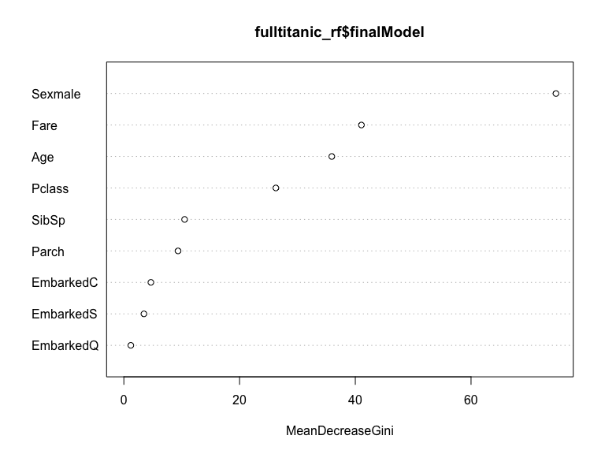

Part 2: Revisiting the Titanic
================
Jess Robinson
May 13, 2019

1. Load Data
============

|  PassengerId|  Survived|  Pclass| Name                                                | Sex    |  Age|  SibSp|  Parch| Ticket           |     Fare| Cabin | Embarked | as.factor(Survived) |
|------------:|---------:|-------:|:----------------------------------------------------|:-------|----:|------:|------:|:-----------------|--------:|:------|:---------|:--------------------|
|            1|         0|       3| Braund, Mr. Owen Harris                             | male   |   22|      1|      0| A/5 21171        |   7.2500|       | S        | 0                   |
|            2|         1|       1| Cumings, Mrs. John Bradley (Florence Briggs Thayer) | female |   38|      1|      0| PC 17599         |  71.2833| C85   | C        | 1                   |
|            3|         1|       3| Heikkinen, Miss. Laina                              | female |   26|      0|      0| STON/O2. 3101282 |   7.9250|       | S        | 1                   |
|            4|         1|       1| Futrelle, Mrs. Jacques Heath (Lily May Peel)        | female |   35|      1|      0| 113803           |  53.1000| C123  | S        | 1                   |
|            5|         0|       3| Allen, Mr. William Henry                            | male   |   35|      0|      0| 373450           |   8.0500|       | S        | 0                   |
|            6|         0|       3| Moran, Mr. James                                    | male   |   NA|      0|      0| 330877           |   8.4583|       | Q        | 0                   |

2. Logistic Regression Models
=============================

Predictions
-----------

*Age + Sex + Fare Model*

    ## 
    ## Call:
    ## glm(formula = Survived ~ Age + Sex + Fare, family = binomial, 
    ##     data = titanic)
    ## 
    ## Deviance Residuals: 
    ##     Min       1Q   Median       3Q      Max  
    ## -2.4107  -0.6376  -0.5875   0.7900   2.0342  
    ## 
    ## Coefficients:
    ##              Estimate Std. Error z value Pr(>|z|)    
    ## (Intercept)  0.934841   0.239101   3.910 9.24e-05 ***
    ## Age         -0.010570   0.006498  -1.627    0.104    
    ## Sexmale     -2.347599   0.189956 -12.359  < 2e-16 ***
    ## Fare         0.012773   0.002696   4.738 2.16e-06 ***
    ## ---
    ## Signif. codes:  0 '***' 0.001 '**' 0.01 '*' 0.05 '.' 0.1 ' ' 1
    ## 
    ## (Dispersion parameter for binomial family taken to be 1)
    ## 
    ##     Null deviance: 964.52  on 713  degrees of freedom
    ## Residual deviance: 716.07  on 710  degrees of freedom
    ##   (177 observations deleted due to missingness)
    ## AIC: 724.07
    ## 
    ## Number of Fisher Scoring iterations: 5

*Class + Fare Model*

    ## 
    ## Call:
    ## glm(formula = Survived ~ Pclass + Fare, family = binomial, data = titanic)
    ## 
    ## Deviance Residuals: 
    ##     Min       1Q   Median       3Q      Max  
    ## -1.9170  -0.7866  -0.7541   1.0218   1.6905  
    ## 
    ## Coefficients:
    ##              Estimate Std. Error z value Pr(>|z|)    
    ## (Intercept)  0.897125   0.294920   3.042  0.00235 ** 
    ## Pclass      -0.684016   0.107156  -6.383 1.73e-10 ***
    ## Fare         0.005516   0.002248   2.454  0.01414 *  
    ## ---
    ## Signif. codes:  0 '***' 0.001 '**' 0.01 '*' 0.05 '.' 0.1 ' ' 1
    ## 
    ## (Dispersion parameter for binomial family taken to be 1)
    ## 
    ##     Null deviance: 1186.7  on 890  degrees of freedom
    ## Residual deviance: 1077.0  on 888  degrees of freedom
    ## AIC: 1083
    ## 
    ## Number of Fisher Scoring iterations: 4

*Age + Sex + Age/Sex Interaction Model*

    ## 
    ## Call:
    ## glm(formula = Survived ~ Age + Sex + Age * Sex, family = binomial, 
    ##     data = titanic)
    ## 
    ## Deviance Residuals: 
    ##     Min       1Q   Median       3Q      Max  
    ## -1.9401  -0.7136  -0.5883   0.7626   2.2455  
    ## 
    ## Coefficients:
    ##             Estimate Std. Error z value Pr(>|z|)   
    ## (Intercept)  0.59380    0.31032   1.913  0.05569 . 
    ## Age          0.01970    0.01057   1.863  0.06240 . 
    ## Sexmale     -1.31775    0.40842  -3.226  0.00125 **
    ## Age:Sexmale -0.04112    0.01355  -3.034  0.00241 **
    ## ---
    ## Signif. codes:  0 '***' 0.001 '**' 0.01 '*' 0.05 '.' 0.1 ' ' 1
    ## 
    ## (Dispersion parameter for binomial family taken to be 1)
    ## 
    ##     Null deviance: 964.52  on 713  degrees of freedom
    ## Residual deviance: 740.40  on 710  degrees of freedom
    ##   (177 observations deleted due to missingness)
    ## AIC: 748.4
    ## 
    ## Number of Fisher Scoring iterations: 4

10-fold validation
------------------

| model                           |  Mean Square Estimate (MSE)|
|:--------------------------------|---------------------------:|
| Age + Sex + Fare                |                   0.1656032|
| Fare + Class                    |                   0.2100600|
| Age + Sex + Age/Sex Interaction |                   0.1708576|

Of the above models, Age + Sex + Fare has the lowest MSE, suggesting it is the best predictive model of the three.

3. Random Forest Model
======================

    ## Random Forest 
    ## 
    ## 714 samples
    ##   7 predictor
    ##   2 classes: '0', '1' 
    ## 
    ## No pre-processing
    ## Resampling results across tuning parameters:
    ## 
    ##   mtry  Accuracy   Kappa    
    ##   2     0.8109244  0.5941098
    ##   5     0.8109244  0.6035063
    ##   9     0.7969188  0.5755402
    ## 
    ## Accuracy was used to select the optimal model using the largest value.
    ## The final value used for the model was mtry = 2.

Variable Importance Plots
-------------------------

The most important variable in predicting Titanic survival, according to the above chart, is sex.

Out-of-Bag Error Rate
---------------------

    ## 
    ## Call:
    ##  randomForest(x = x, y = y, ntree = 500, mtry = param$mtry) 
    ##                Type of random forest: classification
    ##                      Number of trees: 500
    ## No. of variables tried at each split: 2
    ## 
    ##         OOB estimate of  error rate: 18.77%
    ## Confusion matrix:
    ##     0   1 class.error
    ## 0 388  36  0.08490566
    ## 1  98 192  0.33793103

The OOB estimate of error rate is 18.77%.
